# Secure Reliable File Transfer (SRFT)

**CS 5700 Fundamentals of Computer Networking** 

**Team:** Weiting Liu, Youran Ye, Jingkai Liu, Yinfei Lu

This is our group project. We built a file transfer program on top of UDP using raw sockets. We wrote the IP header and the UDP header ourselves, and wrap our SRFT header inside the UDP payload. On top of that we add two layers: a reliability layer (Phase 1) and a security layer (Phase 2).

The client asks the server for a file by name. The server reads the file from disk, splits it into 1024 byte chunks, and sends them back as datagrams. The client reassembles everything in order, writes it to disk, and checks that the final file matches the original with md5sum (Phase 1) and SHA-256 (Phase 2). If both match, the transfer was clean.

## Project Files

- `config.py` all settings
- `packet_helper.py` all helper functions
- `SRFT_UDPServer.py` server 
- `SRFT_UDPClient.py` client
- `server/` test files on the server side (`test_10mb_file`, `test_100mb_file`, `test_500mb_file`, `test_800mb_file`, `test_1gb_file`)
- `client/` folder where the client writes the received file
- `Server_Report.txt` Server report
- `Client_Report.txt` Client report
- `Phase1_Test/` terminal logs for testing Phase 1 at 0%, 2%, 3%, 4% packet loss
- `Phase2_Test/` terminal logs for testing Phase 2 tests
- `Screenshot/` screenshots from every test output
- Meeting notes link: https://docs.google.com/document/d/1D8LiiGRiL4dU5fP4ayz8CS0LWO30tbBCiDpL7fOxG40/edit?usp=sharing
- Project management tool link: https://docs.google.com/document/d/1D8LiiGRiL4dU5fP4ayz8CS0LWO30tbBCiDpL7fOxG40/edit?tab=t.mgc2hi577vaj

## Program work steps

1. Client sends the filename to the server. 
2. Phase 2 only: Client and server do a PSK handshake and derive session keys with HKDF-SHA256.
3. Server read the file, splits it into 1024 byte chunks, and sends them.
4. Each packet has a sequence number, a checksum, and AES-256-GCM encryption with AAD (Phase 2).
5. client send cumulative ACK every 3 packets
6. If the server doesn't get an ACK in 0.1 seconds, it retransmits unacked packets.
7. When everything is done, server sends SHA256 of the original, client compares. If equal it success.

## Run the Programs

We tested everything on two AWS EC2 instances (Amazon Linux 2023, free tier, t3.micro). One machine runs the server, the other runs the client.

**Create a key pair on AWS**

Log in to AWS. Go to EC2 → Network & Security → Key Pairs → Create key pair. 

Name it srft-key, pick .pem format, and download the file. I saved mine on the Desktop.

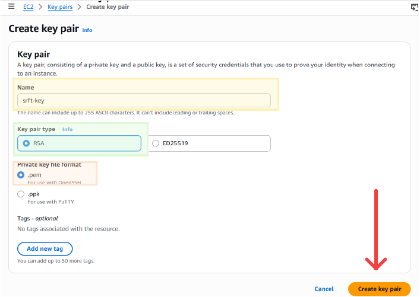 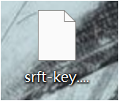

After downloading, lock the file permissions:

```bash
chmod 400 ~/Desktop/srft-key.pem
```

**Create a security group**

Go to EC2 → Security Groups → Create security group. 

Name it srft-sg. Add four inbound rules so our two EC2s can reach each other and we can SSH in from local:

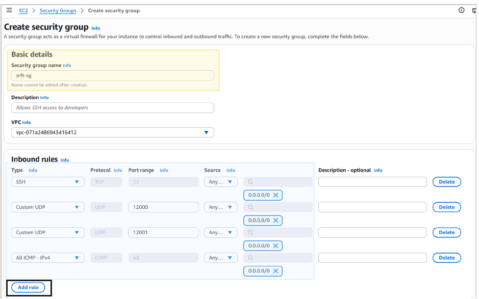

**Launch two EC2 instances**

Go to EC2 → Instances → Launch instances. 

choose Amazon Linux 2023, t3.micro, pick key pair srft-key and security group srft-sg. Launch twice so we get two machines. We named them:
- Server: `SRFT-Server`
- Client: `SRFT-Client`

  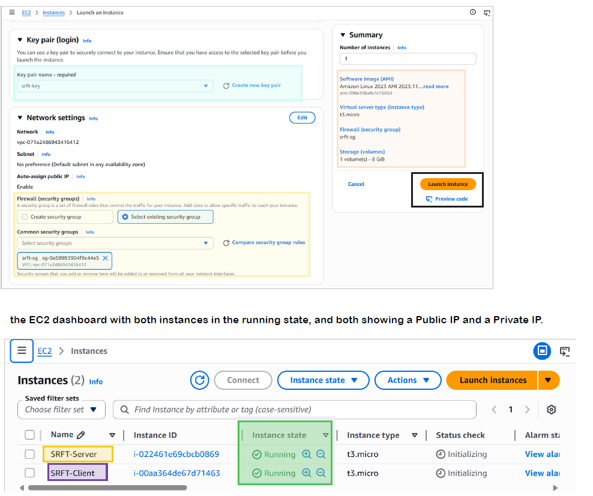

Write down four things:
- `SERVER_PUBLIC_IP` SSH into server
- `CLIENT_PUBLIC_IP` SSH into client EC2
- `SERVER_PRIVATE_IP` in `config.py` line 6 as serverIP
- `CLIENT_PRIVATE_IP` in `config.py` line 9 as clientIP


  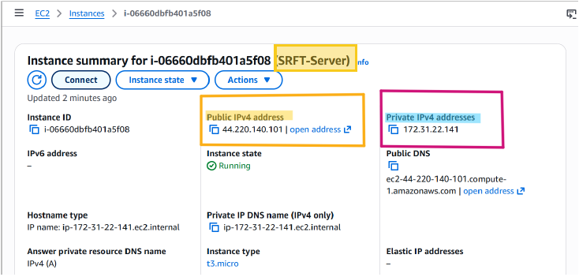 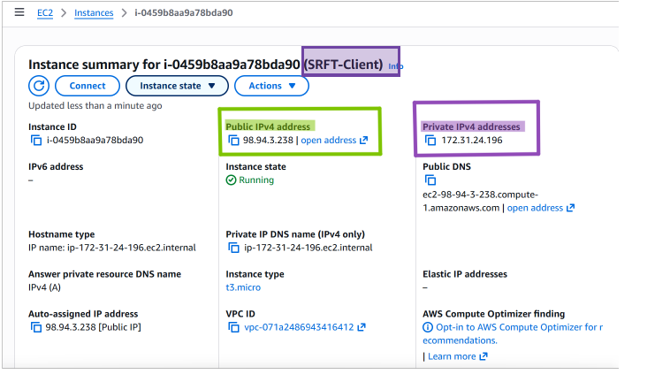

**SSH into both EC2s**

Open two terminals. 

In terminal 1 (server), in terminal 2 (client):

```bash
# Terminal 1 server
ssh -i ~/Desktop/srft-key.pem ec2-user@SERVER_PUBLIC_IP

# Terminal 2 client
ssh -i ~/Desktop/srft-key.pem ec2-user@CLIENT_PUBLIC_IP
```

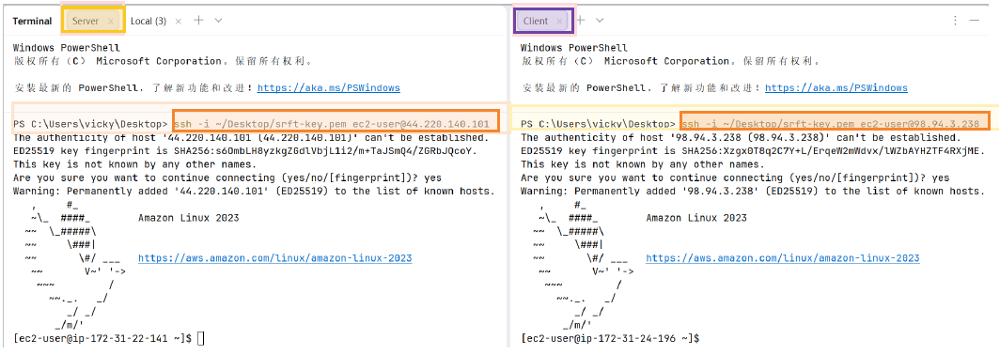

**Install Cryptography Library**

Phase 2 needs AES-256-GCM, HKDF, and HMAC:
```bash
# Both server and client
sudo yum install python3-pip -y
sudo pip3 install cryptography
```

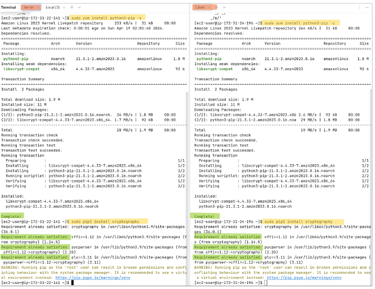

**Edit`config.py` With the Private IP**

Edit `config.py` locally and change line 6, 9 to server and client private ip and change line 12 to false for Phase 1:

```python
# line 6 in config.py
serverIP = 'SERVER_EC2_PRIVATE_IP'
# line 9
clientIP = 'CLIENT_EC3_PRIVATE_IP'
# line 12, set to False for Phase 1
securityEnabled = False           
```
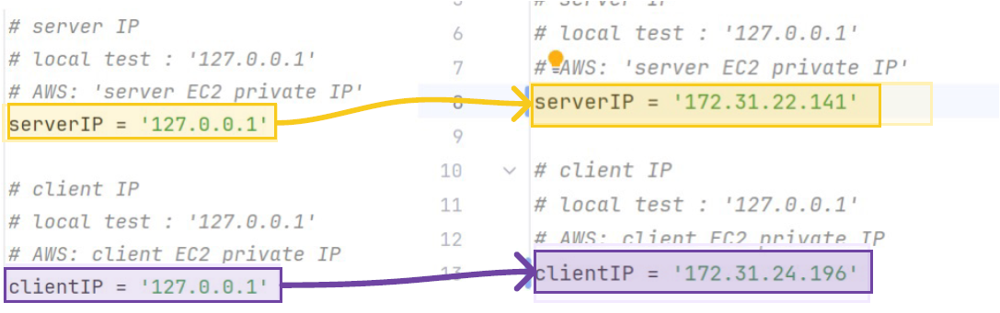
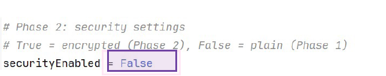

**Upload the code and test files**

Open third terminal on the laptop, inside the project folder:

```bash
# Terminal 3 copy code files to both EC2
scp -i ~/Desktop/srft-key.pem *.py ec2-user@SERVER_PUBLIC_IP:~/
scp -i ~/Desktop/srft-key.pem *.py ec2-user@CLIENT_PUBLIC_IP:~/

# copy the test files (server/) to server only
scp -i ~/Desktop/srft-key.pem -r server ec2-user@SERVER_PUBLIC_IP:~/
```

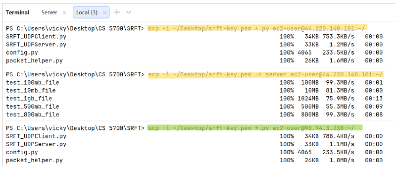

**Ping Test**

From server ping client private IP and from client ping server: 

```bash
# server EC2
ping CLIENT_PRIVATE_IP -c 5

# client EC2
ping SERVER_PRIVATE_IP -c 5
```
Both should reply with 0% packet loss.  If ping fails, the security group is wrong.
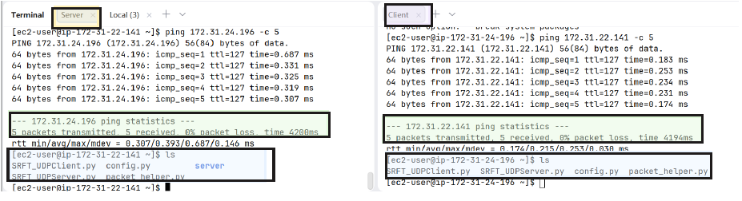

### Run Phase 1 (no packet loss)

Start the server first:

```bash
# server EC2
sudo python3 SRFT_UDPServer.py
```

Then start client with filename choose to test:
```bash
# client EC2
sudo python3 SRFT_UDPClient.py test_10mb_file
```
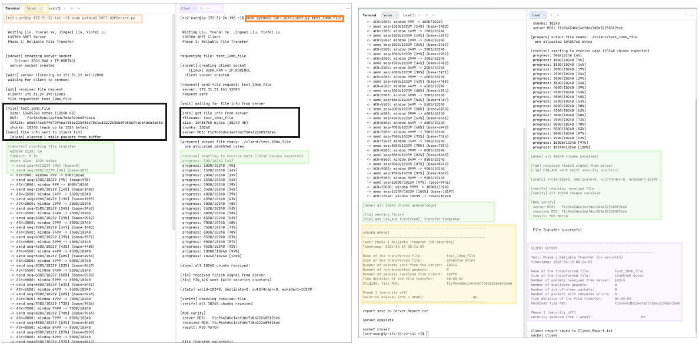
The server listens, the client sends the filename in a FILENAME packet, the server replies with FILE_INFO (size + chunk count), then data chunks start flowing. At the end both sides print a SERVER REPORT / CLIENT REPORT block

**Verify file with md5sum**

```bash
# server EC2
md5sum server/test_10mb_file

# client EC2
md5sum client/test_10mb_file
```
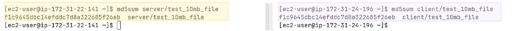
The two hashes should be exactly the same

### Simulate Packet Loss with tc netem

test with 2% to 4% packet loss. We use the Linux `tc` (traffic control) tool with the netem to drop a fixed percentage of outbound packets on the server.

**Install tc on the server**
```bash
# Server EC2
sudo yum install iproute-tc -y
# find the interface name (Amazon Linux 2023 uses ens5)
ip link show        
```
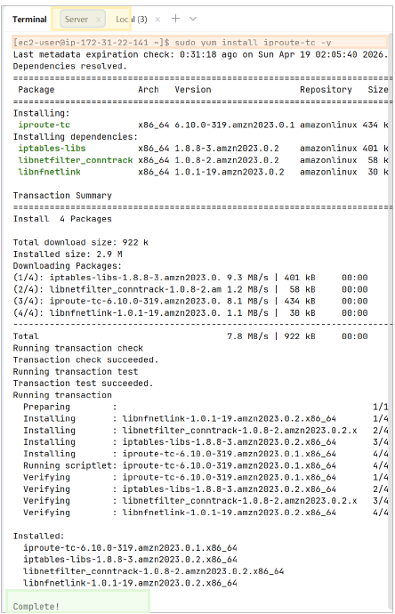

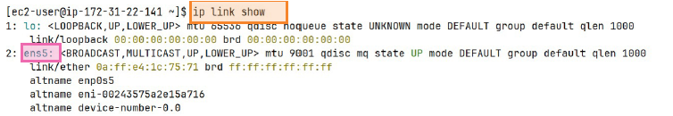

**Turn on 3% packet loss on server outbound**
```bash
sudo tc qdisc add dev ens5 root netem loss 3%
```

**Verify packet loss**
From the client, ping the server 20 times and should see a few percent lost:
```bash
ping SERVER_PRIVATE_IP -c 20
```
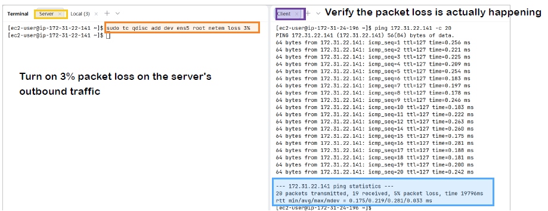


**run the transfer with loss**
```bash
# server
sudo python3 SRFT_UDPServer.py

# client
sudo python3 SRFT_UDPClient.py test_10mb_file
```
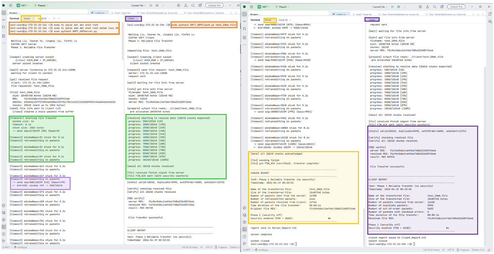

The server will show [timeout] retransmitting 64 packets messages, which is our timeout thread resending the whole window b/c ACK does not arrive. The transfer still completes and the MD5 still matches at the end.

**Switch between loss levels**
```bash
# remove
sudo tc qdisc del dev ens5 root 
# or 3%, 4%                        
sudo tc qdisc add dev ens5 root netem loss 2%   
```
**Test 2% packet loss**
```bash
# server
sudo tc qdisc del dev ens5 root 
sudo tc qdisc add dev ens5 root netem loss 2%
sudo python3 SRFT_UDPServer.py

# client
sudo python3 SRFT_UDPClient.py test_10mb_file
```
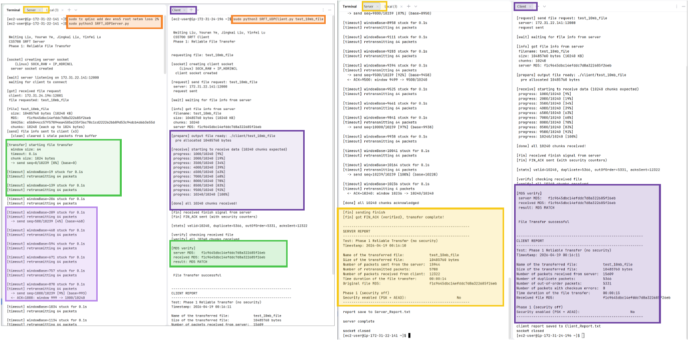

**Test 4% packet loss**
```bash
# server
sudo tc qdisc del dev ens5 root 
sudo tc qdisc add dev ens5 root netem loss 4%
sudo python3 SRFT_UDPServer.py

# client
sudo python3 SRFT_UDPClient.py test_10mb_file
```
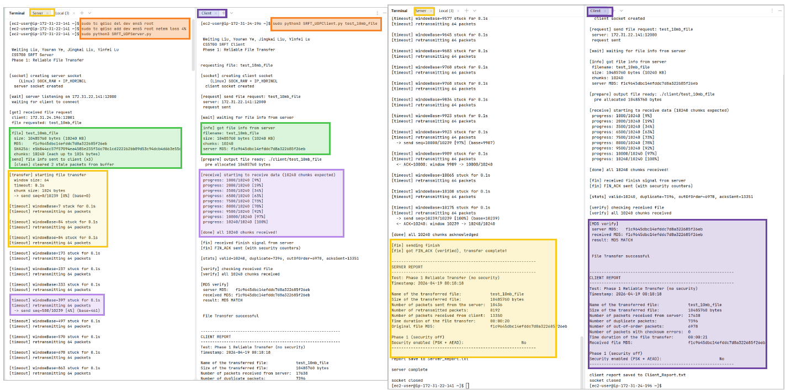

### Phase 2 Security Tests

**Switch to Phase 2 by edit line12 in config.py on both EC2**

```python
# edit to True for phase 2
securityEnabled = True
```

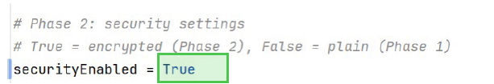

**Push updated config.py to both EC2**


### Test 1 Secure Transfer (Baseline, no attacks)
```bash
# server
sudo python3 SRFT_UDPServer.py

# client
sudo python3 SRFT_UDPClient.py test_10mb_file
```
at the start of the transfer will see the handshake messages green highlight (ClientHello,ServerHello,handshake ok), and every DATA and ACK packet is encrypted.
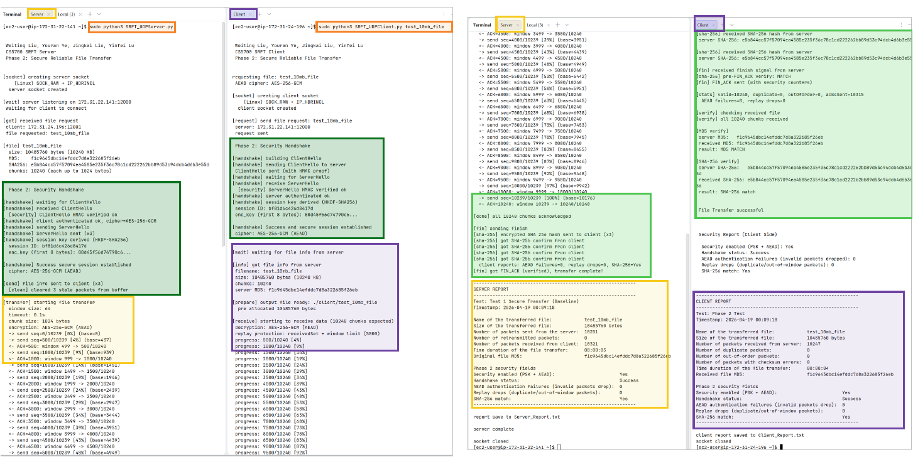
Expected: handshake Success, AEAD failures = 0, replay drops = 0, SHA-256 = Yes.

### Test 2 Wrong PSK (Authentication Failure)

On the client only, change the PSK ( line 18 in config.py) to something that does not match:
```python
# line 18 in config.py change to this: 
psk = b'wrong-key-that-does-not-match!!'
```

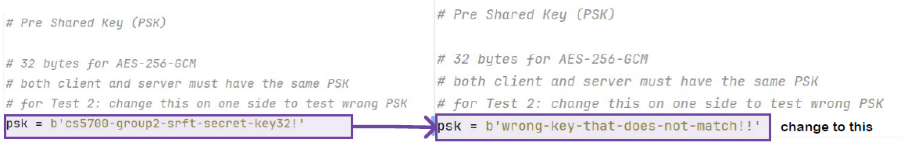

Push that update config.py to the client only: 
```bash
# wrong psk config to client ec2 only
scp -i ~/Desktop/srft-key.pem config.py ec2-user@CLIENT_PUBLIC_IP:~/
```
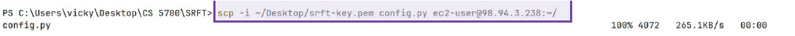

then run:
```bash
# server (correct PSK)
sudo python3 SRFT_UDPServer.py

# client (wrong PSK)
sudo python3 SRFT_UDPClient.py test_10mb_file
```
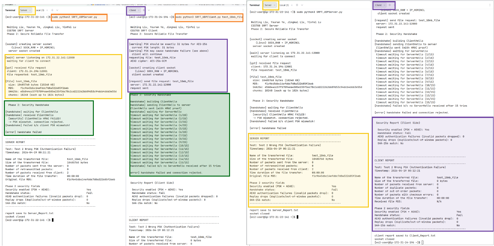
Expected: the server prints ClientHello HMAC verify failed and rejects. The client times out up to 15 times waiting for a ServerHello that never comes. Handshake = Fail, and no file is written.

**After the test, put the correct PSK back on the client**
```bash
# config.py line 18 change back to this:
psk = b'cs5700-group2-srft-secret-key32!'

# upload config.py to client ec2
scp -i ~/Desktop/srft-key.pem config.py ec2-user@CLIENT_PUBLIC_IP:~/
```
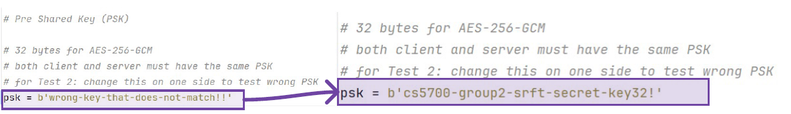
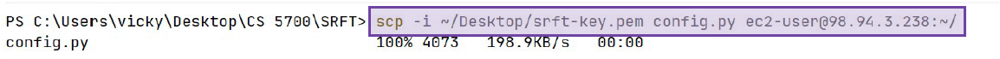

### Test 3 Tamper Detection

```bash
# server
sudo python3 SRFT_UDPServer.py --attack tamper

# client
sudo python3 SRFT_UDPClient.py test_10mb_file
```
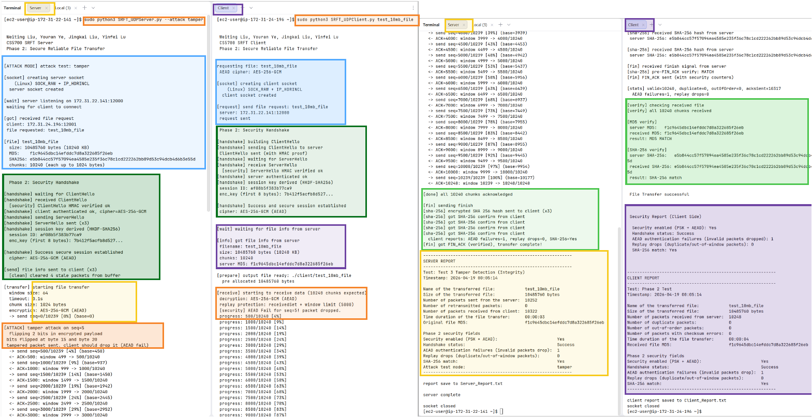
The server flips two bits inside the encrypted payload of one DATA packet before sending. Client AES-GCM tag check fails, the packet is dropped, AEAD authentication failures = 1. Then the retransmit thread sends a clean copy, the file completes, and SHA-256 match = Yes.

### Test 4 Replay Protection

```bash
# server
sudo python3 SRFT_UDPServer.py --attack replay

# client
sudo python3 SRFT_UDPClient.py test_10mb_file
```
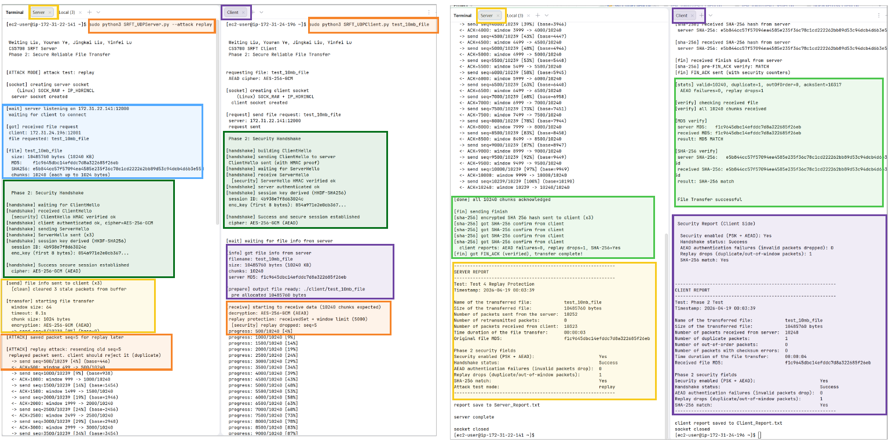
The server saves one valid DATA packet and re sends it later. Client has already written that sequence number, sees it in its receivedSet, and drops it as a duplicate. Replay drops = 1, SHA-256 match = Yes.

### Test 5 Forged Injection

```bash
# server
sudo python3 SRFT_UDPServer.py --attack inject
# client
sudo python3 SRFT_UDPClient.py test_10mb_file
```
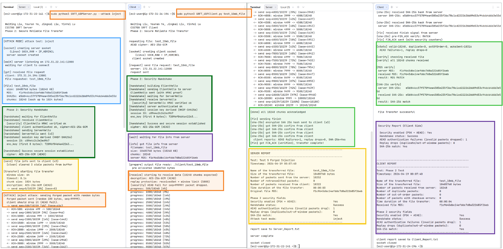

The server inserts one extra packet full of random bytes with a bogus sequence number. Client AES-GCM auth tag check fails because the random bytes are not real ciphertext under our session key. AEAD authentication failures = 1, SHA-256 match = Yes.

**Pull reports back to local**

After running tests, pull down the two report

```bash
scp -i ~/Desktop/srft-key.pem ec2-user@SERVER_PUBLIC_IP:~/Server_Report.txt .
scp -i ~/Desktop/srft-key.pem ec2-user@CLIENT_PUBLIC_IP:~/Client_Report.txt .
```
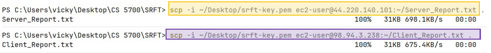

**Stop the instances when done**

From the EC2 console, select both instances → Stop

# Test Results Table

## Phase 1 Reliable Transfer (no security)

**No packet loss (0%):**

| File | Size | Sent | Retransmits | Client Received | Duration | MD5 match |
| --- | --- | --- | --- | --- | --- | --- |
| test_10mb_file | 10,485,760 | 10,244 | 0 | 10,287 | 00:00:02 | Yes |
| test_100mb_file | 104,857,600 | 102,404 | 0 | 102,832 | 00:00:21 | Yes |
| test_500mb_file | 524,288,000 | 512,004 | 0 | 514,028 | 00:01:41 | Yes |
| test_800mb_file | 838,860,800 | 819,204 | 0 | 822,649 | 00:02:53 | Yes |
| test_1gb_file | 1,073,741,824 | 1,048,580 | 0 | 1,052,716 | 00:03:28 | Yes |

**2% packet loss:**

| File | Size | Sent | Retransmits | Client Received | Duration | MD5 match |
| --- | --- | --- | --- | --- | --- | --- |
| test_10mb_file | 10,485,760 | 16,324 | 6,080 | 12,412 | 00:00:15 | Yes |
| test_100mb_file | 104,857,600 | 163,913 | 61,509 | 125,220 | 00:02:36 | Yes |
| test_500mb_file | 524,288,000 | 815,169 | 303,165 | 623,361 | 00:12:49 | Yes |
| test_800mb_file | 838,860,800 | 1,301,060 | 481,856 | 996,521 | 00:20:25 | Yes |
| test_1gb_file | 1,073,741,824 | 1,667,326 | 618,746 | 1,275,921 | 00:26:13 | Yes |

**3% packet loss:**

| File | Size | Sent | Retransmits | Client Received | Duration | MD5 match |
| --- | --- | --- | --- | --- | --- | --- |
| test_10mb_file | 10,485,760 | 16,836 | 6,592 | 12,556 | 00:00:16 | Yes |
| test_100mb_file | 104,857,600 | 175,296 | 72,892 | 129,530 | 00:03:03 | Yes |
| test_500mb_file | 524,288,000 | 874,900 | 362,896 | 645,476 | 00:15:15 | Yes |
| test_800mb_file | 838,860,800 | 1,403,250 | 584,046 | 1,035,993 | 00:24:36 | Yes |
| test_1gb_file | 1,073,741,824 | 1,793,284 | 744,704 | 1,324,756 | 00:31:15 | Yes |

**4% packet loss:**

| File | Size | Sent | Retransmits | Client Received | Duration | MD5 match |
| --- | --- | --- | --- | --- | --- | --- |
| test_10mb_file | 10,485,760 | 18,507 | 8,263 | 13,356 | 00:00:20 | Yes |
| test_100mb_file | 104,857,600 | 184,078 | 81,674 | 132,611 | 00:03:25 | Yes |
| test_500mb_file | 524,288,000 | 920,893 | 408,889 | 664,340 | 00:17:06 | Yes |
| test_800mb_file | 838,860,800 | 1,474,560 | 655,356 | 1,063,476 | 00:27:29 | Yes |
| test_1gb_file | 1,073,741,824 | 1,888,516 | 839,936 | 1,362,414 | 00:35:08 | Yes |

### Phase 2 Secure Transfer (security on)

**Test 1 — Baseline, no packet loss:**

| File | Size | Sent | Retransmits | Client Received | Duration | Handshake | AEAD Fails | Replay Drops | SHA-256 |
| --- | --- | --- | --- | --- | --- | --- | --- | --- | --- |
| test_10mb_file | 10,485,760 | 10,251 | 0 | 10,259 | 00:00:03 | Success | 0 | 0 | Yes |
| test_100mb_file | 104,857,600 | 102,411 | 0 | 102,477 | 00:00:31 | Success | 0 | 0 | Yes |
| test_500mb_file | 524,288,000 | 512,011 | 0 | 512,324 | 00:02:30 | Success | 0 | 0 | Yes |
| test_800mb_file | 838,860,800 | 819,212 | 0 | 819,711 | 00:04:04 | Success | 0 | 0 | Yes |
| test_1gb_file | 1,073,741,824 | 1,048,589 | 0 | 1,049,229 | 00:05:14 | Success | 0 | 0 | Yes |

**Test 2 — Wrong PSK (handshake fails, no file written):**

| File | Size | Sent | Received | Handshake | SHA-256 |
| --- | --- | --- | --- | --- | --- |
| test_10mb_file | 10,485,760 | 0 | 2 | Fail | No |
| test_100mb_file | 104,857,600 | 0 | 2 | Fail | No |
| test_500mb_file | 524,288,000 | 0 | 2 | Fail | No |
| test_800mb_file | 838,860,800 | 0 | 2 | Fail | No |
| test_1gb_file | 1,073,741,824 | 0 | 2 | Fail | No |


**Test 3 — Tamper (one bit flipped in flight):**

| File | Size | AEAD Fails | Replay Drops | SHA-256 | Attack |
| --- | --- | --- | --- | --- | --- |
| test_10mb_file | 10,485,760 | 1 | 0 | Yes | tamper |
| test_100mb_file | 104,857,600 | 1 | 0 | Yes | tamper |
| test_500mb_file | 524,288,000 | 1 | 0 | Yes | tamper |
| test_800mb_file | 838,860,800 | 1 | 0 | Yes | tamper |
| test_1gb_file | 1,073,741,824 | 1 | 0 | Yes | tamper |


**Test 4 — Replay (one old packet resent):**

| File | Size | AEAD Fails | Replay Drops | SHA-256 | Attack |
| --- | --- | --- | --- | --- | --- |
| test_10mb_file | 10,485,760 | 0 | 1 | Yes | replay |
| test_100mb_file | 104,857,600 | 0 | 1 | Yes | replay |
| test_500mb_file | 524,288,000 | 0 | 1 | Yes | replay |
| test_800mb_file | 838,860,800 | 0 | 1 | Yes | replay |
| test_1gb_file | 1,073,741,824 | 0 | 1 | Yes | replay |

**Test 5 — Forged Injection (random bytes sent as a packet):**

| File | Size | AEAD Fails | Replay Drops | SHA-256 | Attack |
| --- | --- | --- | --- | --- | --- |
| test_10mb_file | 10,485,760 | 1 | 0 | Yes | inject |
| test_100mb_file | 104,857,600 | 1 | 0 | Yes | inject |
| test_500mb_file | 524,288,000 | 1 | 0 | Yes | inject |
| test_800mb_file | 838,860,800 | 1 | 0 | Yes | inject |
| test_1gb_file | 1,073,741,824 | 1 | 0 | Yes | inject |

### Protocol Works

Every packet has three headers and the payload:
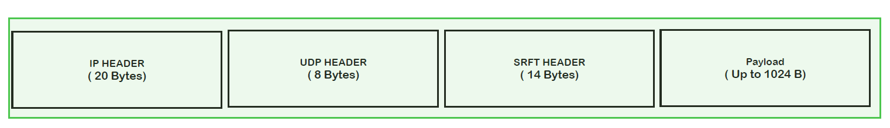
Phase 1 payload is raw file bytes

Phase 2 payload is AES GCM encrypted bytes with nonce (12B) + ciphertext + auth_tag (16B).

### Phase 1 Work Flow

1. **Client → Server:** FILENAME packet with the requested filename.
2. **Server → Client:** FILE_INFO packet with file size and total packet count.
3. **Server → Client:** DATA packets, 1024 bytes each, placed into a sliding window of 64 in flight packets.
4. **Client → Server:** cumulative ACK every 3 rev DATA packet. ACK number = next expected sequence.
5. **Server:** if any packet in the window is not ACKed within timeoutValue = 0.1s, it retransmits the whole unacked window (Go-Back-N).
6. **Server → Client:** `FIN` when the last byte has been ACKed.
7. **Client → Server:** `FIN_ACK` . Both sides compute `md5sum` and compare.

### Phase 2 Work Flow

1. **Client → Server:** CLIENT_HELLO with client_nonce (16 B) + protocol version + cipher name + HMAC-SHA256(PSK, fields)
2. **Server:** verify HMAC generates server_nonce (16B) and session_id (8B). If it fails, the connection is rejected.
3. **Server → Client:** SERVER_HELLO with server_nonce (16 B) + session_id (8 B) + HMAC.
4. **Both sides:** derive enc_key and ack_key with HKDF-SHA256 using PSK and both nonces.
5. **Same flow as Phase 1**, but every DATA and ACK is AES-256-GCM encrypted. The AAD includes `session_id`, `seq`, `ack`, and `type`.
6. **After FIN**, server sends SHA_VERIFY with SHA-256(file_bytes). Client compares with the SHA-256 of the reassembled file and replies with SHA_CONFIRM

### SRFT Header

header format string in config.py is !BIxIHH, 14 bytes, network byte order.

| Offset | Size | Field | What it is                                                  |
| --- | --- | --- |-------------------------------------------------------------|
| 0 | 1 B | `type` | packet type code                                            |
| 1 | 4 B | `seqNum` | sequence number of this chunk                               |
| 5 | 1 B | `pad` | padding byte to keep the next field 4 byte aligned          |
| 6 | 4 B | `ackNum` | cumulative ACK number = next expected seq                   |
| 10 | 2 B | `checksum` | 16 bit one’s-complement checksum over SRFT header + payload |
| 12 | 2 B | `dataLen` | payload length in bytes                                     |

## Phase 1 Design

Four error control: 
1. **Checksum** One complement sum over the SRFT header + payload, No pseudo-header. Wrong checksum will drop the packet, and wait for retransmission.
2. **Sequence Numbers** Every DATA packet gets a seq number. Duplicates are detected. Out of order packets go into a buffer and get in order later.
3. **Cumulative ACK** We send one ACK every 3 received DATA packets.
4. **Retransmission by Timeout** sender thread watch the unacked window. If 0.1s passes without an ACK covering seq N, resend seq N.

### Sliding Window and Flow Control
The server keeps up to windowSize = 64 unacked packets in flight at once.

- windowBase = lowest unACKed sequence number
- nextToSend = the next sequence number to hand to the socket. 
- packet with seq N may be sent only if N < windowBase + windowSize. 
- When ACK arrive with ackNum = N, windowBase jumps forward to N, which opens up new room in the window.

We picked 64 because 16 and 32 were too small (kept draining under loss) and 256 / 512 used more memory without going any faster on EC2.

### Multithreading

If the sender tried to send and wait for ACK on one thread, sending would wait every time if ACK was late. So we split the work.
**Server side:**
- **Main thread** reads chunks, builds packets, and sends DATA as long as nextToSend - windowBase < windowSize.
- **ACK thread** receives ACK packets, parses them, and advances windowBase.
- **Retransmit thread** checks lastWindowMoveTime and resends the unacked window on timeout.

**Client side:**
- **Main thread** receive packets, check the checksum, parses, buffers writes the chunk, and updates expectedSeq.
- **ACK sender thread** sends cumulative ACKs every 3 received packets.

All shared state (the window, the buffer, counters) is protected with threading.Lock(), and every lock is inside a try/finally so it always releases even if an exception is raised.

## Phase 2 Security Design

| Requirement | How it work                                                                                                                   |
| --- |-------------------------------------------------------------------------------------------------------------------------------|
| **Confidentiality** | AES 256 GCM encrypts every DATA and ACK payload.                                                                              |
| **Integrity** | AES GCM authentication tag (16B). Any flipped bit - tag fails - packet dropped.                                               |
| **Authentication** | PSK handshake. Both sides prove they know the PSK via HMAC SHA256 before keys are derived.                                    |
| **Replay Protection** | Receiver tracks accepted sequence numbers. Anything already accepted, or more than 5000 ahead of the expected seq is dropped. |
| **End-to-end check** | Server sends SHA 256(file) in a final AEAD protected control packet. Client recomputes and compares.                          |


**Pre-Shared Key (PSK)** in config.py. Both sides must have the same PSK or the handshake HMAC check will fail.

**Handshake (ClientHello - ServerHello)** Client sends CLIENT_HELLO with a random 16 byte client_nonce, protocol version, cipher name, and an HMAC-SHA256 over those fields using the PSK. Server checks the HMAC. If OK, server picks its own 16 byte server_nonce and 8 byte session_id, and replies with SERVER_HELLO + its HMAC. Client verifies.

**Key Derivation (HKDF-SHA256)** from HKDF(PSK, salt = client_nonce || server_nonce, info = "srft-enc"). Used for AES-256-GCM on DATA.

**AEAD (AES-256-GCM) Encryption** 12 byte nonce is session_id (8 B) || seq_num (4 B) which is unique per (session, seq). AAD covers session_id, seq, ack, and type so an attacker cannot swap those fields without breaking the tag. If decryption fails, the packet is dropped and aeadFailCount increases by one.

**Replay Protection** client keeps a set of every seq it has already written. If the same seq shows up again (replay), it is dropped and replayDropCount increases. If a packet arrives with a seq more than 5000 ahead of what we expect, it is dropped as out of window.

**End to End SHA 256 File Verification** After the last chunk is ACKed, the server hashes original file with SHA-256 and sends it in a SHA_VERIFY packet (AEAD-protected). The client hashes its reassembled file and compares. 


### Design Decisions 

**Chunk size 1024 B.** Small enough to fit well under the Ethernet MTU (1500 B) even after adding 20 B IP + 8 B UDP + 14 B SRFT + 28 B AEAD overhead = 1094 B total. Big enough to keep throughput reasonable.

**Window size 64.** We test 16 and 32 first too small, the pipe drained under loss. 256 and 512 used more memory without going any faster on EC2. 64 is good

**ACK every 3 packets.** Avoids one ACK per packet flood. Low enough to save bandwidth, fast enough that the window keeps moving

**Fixed timeout 0.1 s.** we test few timeout from 0.05s to 2.0s. We picked 0.1 second. it is works well on AWS where RTT is around 1–2 ms and short enough that we do not waste time waiting.

**Nonce = session_id || seq.** AES-GCM needs 12byte nonce that is unique per key. We put 8B session_id with the 4B seq to get exactly 12 bytes, make sure it is unique

**flushSocket() before each transfer.** Drains leftover packets from a previous run so old data does not confuse a new transfer.

### Known Limitations

1. **Fixed chunk size (1024 B).** 
2. **Fixed timeout.** We use a fixed timeout not a weighted average RTT estimator like real TCP. On very high latency networks this would be too short and cause extra retransmits.
3. Our sliding window is **fixed at 64**, it does not shrink on loss or grow on success.
4. **Go-Back-N** On timeout we resend the whole window, not just the one lost packet. 
5. **One client at a time.** The server only serves one transfer at a time. 
6. **PSK is plaintext in config.py.** real system would read it from a protected file or a secret manager.
7. **Filename goes out in plaintext** (before the handshake). nicer if the handshake first and ask for the filename inside the encrypted channel.

### Lessons Learned

- After implementing cumulative ACK, the sliding window, and the timeout retransmitter by hand, every slide from the TCP Error Control and Pipelining lectures made a lot more sense and we actually understood that algorithm.
- by building the IP and UDP headers we learned how encapsulation works at the byte level. 
- AES-GCM is auth tag that catches tampered or forged packets.
- The checksum only catches random bit flips; AEAD catches attackers.
- getting the AES-GCM requires that no (key, nonce) pair is ever reused, use session_id || seq as the nonce guarantees uniqueness b/c seq never repeats.
- Binding session_id, seq, ack, and type into the AEAD as AAD to authenticates the metadata. If we only encrypted the payload, attacker could still swap seq numbers and mess up the order
- Threading locks matter. The first time we forgot try/finally, the program froze when an exception hit inside the lock.

### Possible Future Improvements

- only retransmit the lost packets, not the whole window.
- using Jacobson or TCP style RTT estimator prevent over retransmit on a fast link or under retransmit.
- **SACK style ACKs** so the client can tell the server exactly which seq numbers are missing.
- **Congestion control** (AIMD) so the window shrinks on loss and grows on success.
- **Multi client support** on the server side.
- Use a real key exchange so we don’t need a pre-shared key.


