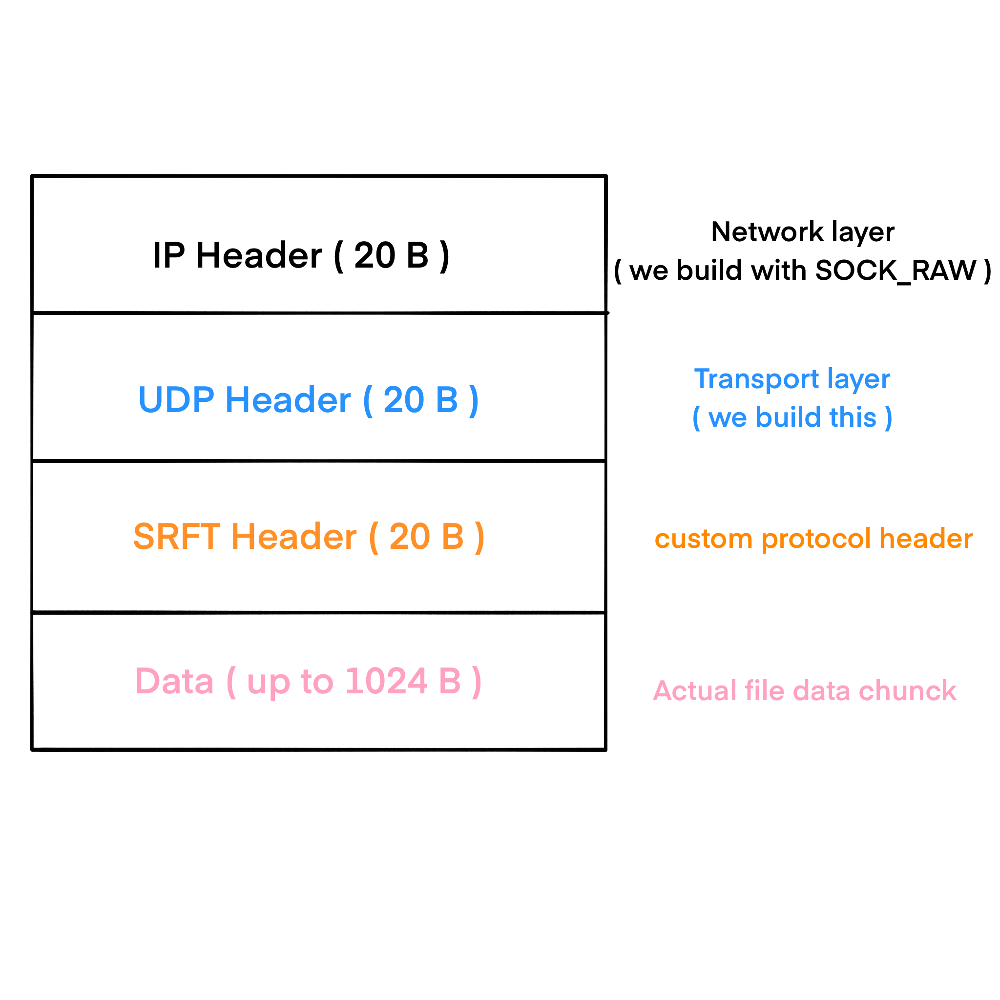
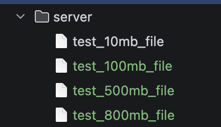
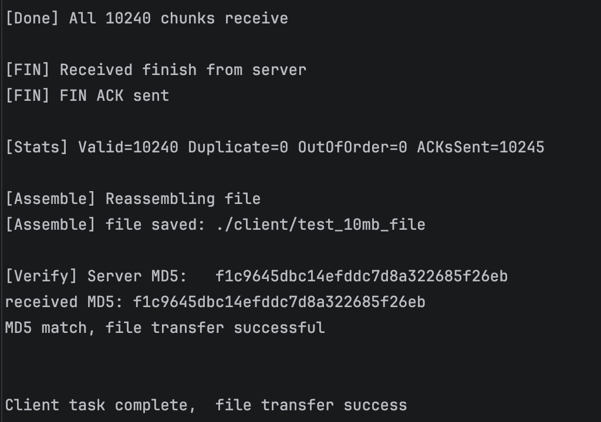
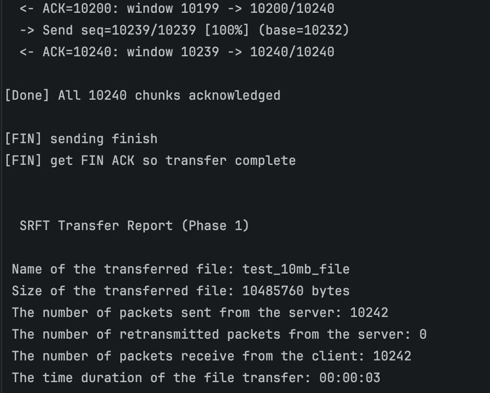
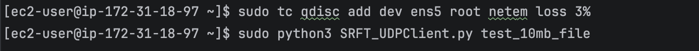
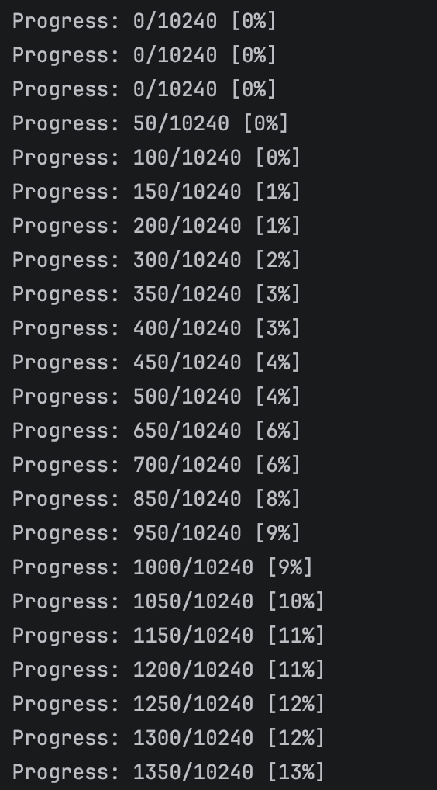
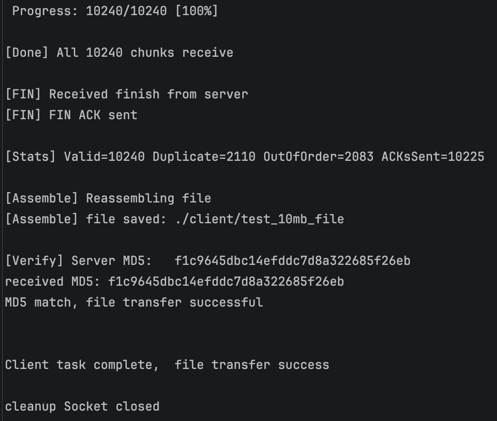
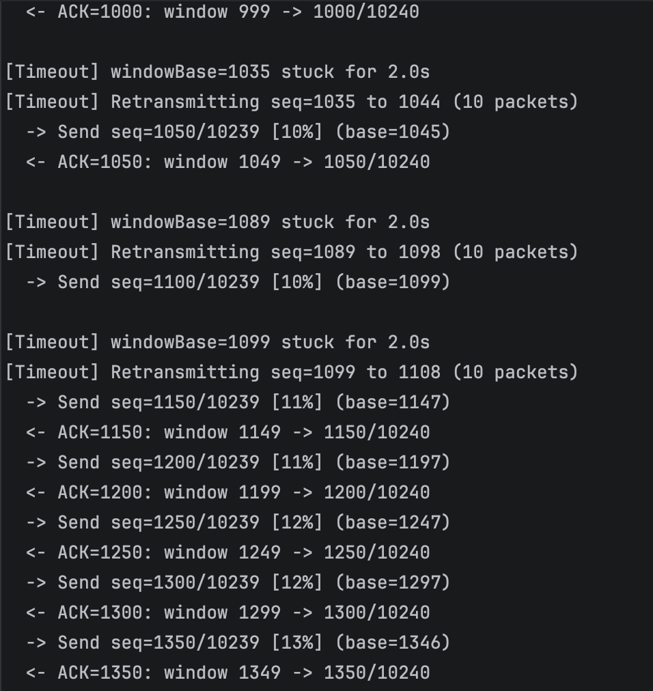
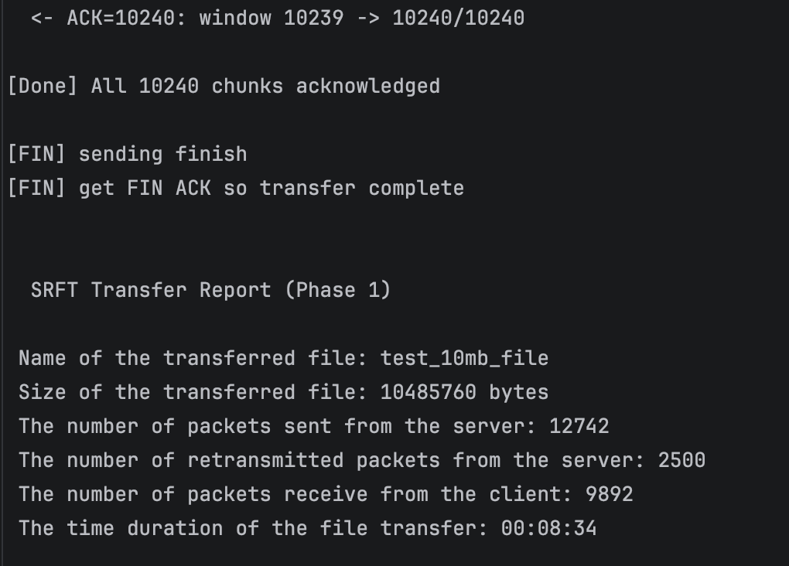

# Secure Reliable File Transfer

## CS5700 Fundamentals of Computer Networking

### Group 2 : Jingkai Liu, Weiting Liu, Youran Ye, Yinfei Lu


## SRFT

This is our group project for CS5700. We built a file transfer program in Python that runs on top of UDP, but we make it act like TCP for the reliable parts, 
and we also add a security layer on top of UDP so the file cannot be read, 
changed, replayed, or faked by an attacker. We use raw sockets (`SOCK_RAW`) 
and build our own IP and UDP headers by hand with the `struct` module

### The project has two phases

**Phase 1 Reliable File Transfer.** The client asks the server for a file by name, the server breaks the file into small chunks and sends them back using a sliding window. Each packet has a checksum, a sequence number, 
and we use cumulative acknowledgments so we do not send one ACK per packet. If a packet is lost, the server retransmits it after a fixed timeout. At the end, the MD5 hash on the server side and the client side must match.

**Phase 2 — Secure Reliable File Transfer.** On top of Phase 1 we add a security layer inside the UDP payload. Before any file data is sent, the client and the server do a short handshake using a Pre-Shared Key (PSK). 
Both sides verify each other with HMAC, then both sides derive a fresh session key using HKDF-SHA256. Every DATA and ACK packet after that is encrypted and authenticated using AES-256-GCM (AEAD). At the end we also check the SHA-256 of the whole file end to end. The protocol also rejects replayed and forged packets.


---
## Files in this project

| File | What it does                                                                                                                              |
| --- |-------------------------------------------------------------------------------------------------------------------------------------------|
| `config.py` | All settings in one place (IPs, ports, window size, timeout, PSK, AEAD sizes, attack mode, etc.)                                          |
| `packet_helper.py` | All the helper code: build/parse IP + UDP + SRFT headers, checksum, HKDF, HMAC, AES-GCM encrypt/decrypt, file hashing, filename validation |
| `SRFT_UDPServer.py` | Server side. Waits for a file request, does the handshake, sends the file with sliding window + retransmit, writes the server report      |
| `SRFT_UDPClient.py` | Client side. Sends the file name, does the handshake, receives chunks, writes them to disk in the right order, writes the client report   |
| `server/` | Folder with the test files on the server side (`test_10mb_file`,`test_100mb_file`,`test_500mb_file`,`test_800mb_file`,`test_1gbmb_file`)  |
| `client/` | Folder where the received file gets saved on the client side                                                                              |
| `Server_Report.txt` | Server report                                                                                                                             |
| `Client_Report.txt` | Client report                                                                                                                             |


---

### Protocol

### Packet layout

Every packet is made of three headers plus the data:

```
 +----------+----------+----------+-------------+
 |   IP     |   UDP    |   SRFT   |    Data     |
 | 20 bytes | 8 bytes  | 14 bytes |  0..1024 B  |
 +----------+----------+----------+-------------+
```

**Step 1: Client sends a file request**
The client sends the filename to the server (like a GET request).

**Step 2: Server sends file info**
The server replies with filename, file size, total number of chunks, and MD5 hash.

**Step 3: Server sends data using sliding window**
The server splits the file into 1024-byte chunks and sends them using a sliding window
(windowSize = 10). This is the same concept as TCP sliding window from our lecture.
The server can send up to 10 packets before waiting for ACKs.

**Step 4: Client receives data and sends cumulative ACKs**
The client receives packets and sends a cumulative ACK every 3 packets (not one ACK per packet).
The cumulative ACK tells the server: "I have received everything before this sequence number."
This is the same as TCP cumulative acknowledgment from our lecture.

If a packet arrives out of order, the client buffers it and waits for the missing packet.
If a packet is a duplicate, the client ignores it.

**Step 5: Retransmission on timeout**
If the server does not receive an ACK for 2 seconds (our fixed timeout), it retransmits
all unACKed packets in the window. This is the same idea as TCP retransmission after timeout.

**Step 6: FIN handshake**
When all data is sent and ACKed, the server sends a FIN packet. The client replies with FIN_ACK.
This is similar to the TCP connection termination from our lecture.

**Step 7: File verification**
The client reassembles all chunks into the original file and computes MD5 hash.
If the MD5 matches the one the server sent, the file transfer is successful.

---

### Custom Protocol Header (SRFT Header)

| Field                     | Size | Description |
|---------------------------|------|-------------|
| Packet Type 'B'           | 1 byte | What kind of packet this is (FILENAME, FILE_INFO, DATA, ACK, FIN, FIN_ACK) |
| Sequence Number  'I'      | 4 bytes | Which chunk this packet carries (used for ordering and duplicate detection) |
| Padding    'x'            | 1 byte | Alignment padding |
| Acknowledgment Number 'I' | 4 bytes | Cumulative ACK (tells sender: I received everything before this number) |
| Checksum  'H'             | 2 bytes | One's complement checksum over header + data (to detect corruption) |
| Data Length 'H'            | 2 bytes | How many bytes of data follow the header |

Total header = 1 + 4 + 1 + 4 + 2 + 2 = **14 bytes**

---

### Packet Structure (Full Packet)

Every packet we send has 3 layers



---

### Error Control Mechanisms

**1. Checksum (detect corrupted packets)**

We calculate one's complement checksum over the SRFT header + data.
The project says "no need to include the pseudo header", so we only checksum
our own protocol header and data.

On the receiver side, we verify the checksum. If it fails, we drop the packet.
This is the same concept as TCP/UDP checksum from our lecture.

**2. Sequence Numbers (detect duplicates and reorder)**

Each data packet has a sequence number (0, 1, 2, ...).
The client tracks `expectedSeq` (the next sequence number it expects).

- If seqNum == expectedSeq: this is the correct next packet, accept it
- If seqNum > expectedSeq: this packet arrived early (out of order), buffer it
- If seqNum < expectedSeq: this is a duplicate, ignore it

same as how TCP uses sequence numbers

**3. Cumulative Acknowledgment (avoid ACK per packet)**

The client sends a cumulative ACK every 3 packets (ackEvery = 3).
if ACK = 50, it means chunks 0 through 49 are all received.
The server can then slide its window forward.

same as TCP cumulative acknowledgment

**4. Retransmission after timeout (fixed timeout)**

We use a fixed timeout of 2.0 seconds.
If the sliding window does not move for 2 seconds, the server retransmits
all unACKed packets in the current window.

This is the same concept as TCP retransmission after timeout from our lecture,
except TCP uses a dynamic timeout based on RTT (we use a fixed value as allowed).

---

### Sliding Window (Flow Control)

Our server uses a sliding window of size 10 (windowSize = 10).
This means the server can have up to 10 unACKed packets in flight at once.

- `windowBase` = the oldest unACKed packet (left edge of window)
- `nextToSend` = the next packet to send

When an ACK arrives, the window slides forward (windowBase moves right).
This is the same as the TCP sliding window mechanism from our lecture.

---

### Multithreading

We use Python threading to handle sending and receiving at the same time:

- **Main thread**: runs the sliding window sender (sends data packets)
- **ACK receiver thread**: listens for ACK packets from the client
- **Retransmit watcher thread**: monitors for timeouts and retransmits

This is required by the project: "you need to use multiprocessing or multithreading
to handle the transfer of a large file."

---

### How to Run the Program

**Requirements:**
- Python 3 (already installed on AWS EC2)
- Linux (for SOCK_RAW, needs sudo)
- Two machines (or two AWS EC2 instances)

**Step 1: Update config.py with correct IP addresses**

Before running, edit `config.py` to set the correct IP addresses:

```python
# For local testing (on MacOS):
serverIP = '127.0.0.1'
clientIP = '127.0.0.1'

# For AWS testing (use private IPs of EC2 instances):
serverIP = 'Server AWS EC2 Private IP'   
clientIP = 'Client AWS EC2 private IP' 
```

**Step 2: Put test files in the server directory**

Create a `server/` folder and put your test files in it:

```bash
mkdir -p server
# copy sample test files into server/ directory
```


**Step 3: Copy files to AWS EC2**

copy Python files to both EC2 instances:

```bash
# Copy to server EC2
scp -i ~/Desktop/srft-key.pem *.py ec2-user@SERVER_EC2_PUBLIC_IP:~/

# Copy to client EC2
scp -i ~/Desktop/srft-key.pem *.py ec2-user@CLIENT_EC2_PUBLIC_IP:~/
```

Copy server folder to both EC2 :

```bash
# Copy to server EC2
scp -i ~/Desktop/srft-key.pem -r server/ ec2-user@SERVER_EC2_PUBLIC_IP:~/

# Copy to client EC2
scp -i ~/Desktop/srft-key.pem -r server/ ec2-user@CLIENT_EC2_PUBLIC_IP:~/
```

**Step 4: Run the server (on server EC2)**

```bash
sudo python3 SRFT_UDPServer.py
```

The server will wait for a client to connect.

**Step 5: Run the client (on client EC2)**

```bash
sudo python3 SRFT_UDPClient.py test_10mb_file
```

The client will request the file and start receiving.

---

### Simulate Packet Loss on AWS

On the **client and server** EC2 instance, use the `tc` (traffic control) command:

```bash
# Install tc if not already installed
sudo yum install iproute-tc

# Add 3% packet loss
sudo tc qdisc add dev ens5 root netem loss 3%

# To remove packet loss after testing
sudo tc qdisc del dev ens5 root
```

> network interface name may be `eth0` or `ens5` depending on EC2 instance.
> Use `ip link show` to check the correct interface name.

---

### Test Results

We tested our program locally and AWS EC2 :

#### Local Testing with 10mb (No Packet Loss)

- **File:** test_10mb_file (10,485,760 bytes = 10 MB)
- **Chunks:** 10,240 (each 1024 bytes)
- **Result:** All 10,240 chunks received
- **Duplicates:** 0
- **Out of Order:** 0
- **MD5 Match:** YES

```
Server MD5:   f1c9645dbc14efddc7d8a322685f26eb
Received MD5: f1c9645dbc14efddc7d8a322685f26eb
MD5 match, file transfer successful
```

> **Screenshot location:** Take a screenshot of the client terminal showing the
> MD5 match message. Also take a screenshot of the server terminal showing
> the transfer report.

#### AWS EC2 Testing (No Packet Loss)

- **Server EC2:** EC2 server private IP)
- **Client EC2:**  EC2 client private IP)
- **File:** test_10mb_file (10 MB)
- **Chunks:** 10,240
- **Result:** All 10,240 chunks received
- **Valid packets:** 10,240
- **Duplicates:** 0
- **Out of Order:** 0
- **ACKs sent:** 10,245
- **MD5 Match:** YES

```
Server MD5:   f1c9645dbc14efddc7d8a322685f26eb
Received MD5: f1c9645dbc14efddc7d8a322685f26eb
MD5 match, file transfer successful
```

> screenshot of the client terminal output on AWS.


> screenshot of the server terminal output and the transfer report on AWS.


#### AWS EC2 Testing (With 3% Packet Loss)

- **Packet loss:** 3% (using `sudo tc qdisc add dev ens5 root netem loss 3%`)
- **File:** test_10mb_file (10 MB)
- **Chunks:** 10,240
- **Result:** All 10,240 chunks received
- **Valid packets:** 10,240
- **Duplicates:** 2,110
- **Out of Order:** 2,083
- **ACKs sent:** 10,225
- **MD5 Match:** YES

```
Server MD5:   f1c9645dbc14efddc7d8a322685f26eb
Received MD5: f1c9645dbc14efddc7d8a322685f26eb
MD5 match, file transfer successful
```

This test shows that our retransmission mechanism works correctly.
Even with 3% packet loss, all chunks were received and the MD5 hash matches.
The 2,110 duplicate packets are because some packets were retransmitted
when the original was lost (the retransmit timer resent them).
The 2,083 out-of-order packets happened because some packets arrived
before the expected sequence number due to retransmissions.


> Screenshot of the `tc` command adding 3% packet loss


> client terminal showing progress with retransmissions
>    (progress stuck at certain percentages, this means
>    packets were lost and waiting for retransmission)



> Screenshot of the client terminal showing the final MD5 match


> Screenshot of the server terminal showing timeout retransmissions


> Screenshot of the server transfer report


---

### Where to Take Screenshots (Summary)

Here is a list of all screenshots you should include in your final submission:

| # | What to Screenshot | Why |
|---|-------------------|-----|
| 1 | Server terminal: waiting for client connection | Shows server is running and listening |
| 2 | Client terminal: requesting file | Shows client sending filename request |
| 3 | Server terminal: sending data with progress | Shows sliding window sender working |
| 4 | Client terminal: receiving data with progress | Shows data being received |
| 5 | Client terminal: MD5 match (no packet loss) | Proves file transfer is correct |
| 6 | Server terminal: transfer report (no packet loss) | Shows all required report fields |
| 7 | Client EC2: `tc` command adding 3% packet loss | Proves we tested with packet loss |
| 8 | Client terminal: progress with retransmissions (packet loss) | Shows retransmission is working (progress gets "stuck" then continues) |
| 9 | Client terminal: MD5 match (with packet loss) | Proves file transfer is correct even with packet loss |
| 10 | Server terminal: timeout retransmissions happening | Shows retransmission mechanism at work |
| 11 | Server terminal: transfer report (with packet loss) | Shows retransmitted packet count > 0 |
| 12 | Using `md5sum` command on both EC2 instances | Proves the file hash is the same on both sides |

**How to use md5sum on EC2:**

```bash
# On server EC2 (check original file)
md5sum server/test_10mb_file

# On client EC2 (check received file)
md5sum client/test_10mb_file
```

Both should show the same hash: `f1c9645dbc14efddc7d8a322685f26eb`

---

### Design Decisions

- Each chunk is **1024** bytes of file data. With our SRFT header (14 bytes),
UDP header (8 bytes), and IP header (20 bytes), the total packet size is
1024 + 14 + 8 + 20 = 1066 bytes, which fits well within the 1500-byte MTU.

- A window size of **10** means up to 10 packets can be in flight at once.
This gives good throughput without overwhelming the network.

- We chose **2.0** seconds for timeout interval which works well for both local and AWS testing.

- Sending ACK every **3** packets reduces overhead while still keeping
the server informed about what has been received.

---

### Known Limitations

- We use a fixed timeout value (2.0s) instead of dynamic RTT estimation.
  The project allows this, but a dynamic timeout could improve performance.
- The current implementation handles one file transfer at a time.
- On local macOS, we use SOCK_DGRAM (normal UDP) for local testing because
  macOS does not support SOCK_RAW for UDP well. 
- On Linux (AWS), we use the required SOCK_RAW with IP_HDRINCL.

---

### Lessons Learned

- Building IP and UDP headers manually helped us understand the protocol stack
  from our lecture at a deeper level.
- Implementing reliable data transfer on top of UDP taught us why TCP needs
  sequence numbers, acknowledgments, checksums, and retransmissions.
- Testing with packet loss on AWS showed us how retransmission actually works
  in practice, not just in theory.
- Using multithreading was important for performance. Without it, the server
  would have to wait for ACKs before sending more data.

